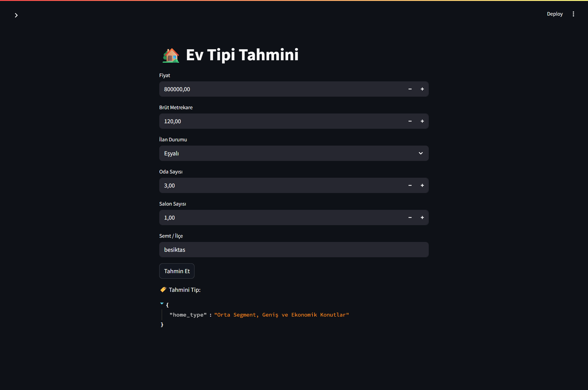

# 🡠Real Estate AI 

⭠Bu proje *`Akbank Makine Öğrenmesine Giriş Bootcamp`* kapsamında geliştirilmiştir.

## 📌 Proje Hakkında
Bu proje, İstanbul’daki satılık ev ilanlarından oluşan gerçek bir veri setini kullanarak geliştirilen çok modelli bir yapay zeka analiz sistemidir. Amacımız, kullanıcıların emlak piyasasıyla etkileşim kurmasını kolaylaştırmak, veri temelli kararlar almasını sağlamak ve makine öğrenmesi destekli modelleri doğal dille erişilebilir kılmaktır.

## 🧾 Giriş
Proje kapsamında Kaggle üzerinden alınan, İstanbul'daki satılık ev ilanlarını içeren gerçek bir [veri seti](https://www.kaggle.com/datasets/aselasel/house-price-dataset) kullanılmıştır. Python ile veri toplama, analiz, modelleme ve birden fazla makine öğrenmesi modelinin geliştirilmesi gerçekleştirilmiştir.

GeliÅŸtirilen Modeller:

- 💰 Fiyat Tahmin Modeli (Regresyon)

- 🚨 Anomali Tespiti (Outlier Detection)

- ğŸ˜ï¸ Ev Tipi Kümelemesi (Clustering)

- 📈 Yatırıma Uygunluk Sınıflandırması (Classification)

Bu modeller, bir LLM (Large Language Model) ajanına entegre edilerek, kullanıcıların veriyle doğal dilde etkileşime geçmesi mümkün hale getirilmiştir.

## 🧠 Modeller ve Elde Edilen Sonuçlar

### 1-Konut Fiyat Tahmini (Regresyon Modeli)ğŸ¡

Bu bölümde, İstanbul’daki satılık konut ilanlarından oluşan veri seti kullanılarak ev fiyatlarını tahmin etmeye yönelik bir regresyon modeli geliştirildi.

#### 🔧 Özellik Mühendisliği
- Veri setinden price, GrossSquareMeters, ItemStatus, room, hall, district gibi temel değişkenler seçildi.

- Kategorik değişkenler (district, ItemStatus) one-hot encoding yöntemiyle sayısallaştırıldı.

- Sayısal veriler StandardScaler ile normalize edildi.

#### 🤖 Modelleme Süreci
- 7 farklı regresyon algoritması test edildi:
Ridge, Linear Regression, KNN, Decision Tree, XGBoost, Gradient Boosting, Random Forest

- Her model için R² skorları ve işlem süreleri ölçüldü.

- XGBoost, doğruluk ve hız açısından en iyi sonuçları verdiği için tercih edildi.

#### âš™ï¸ Hiperparametre Ayarlamaları
- RandomizedSearchCV ile XGBoost için hiperparametre optimizasyonu yapıldı.

- En iyi parametre kombinasyonu 15 farklı denemeyle belirlendi.

#### 📈 Sonuçlar
```yaml
- R² (Doğruluk): 0.8091012239456177

- MAE (Ortalama mutlak hata): 374359.875

- MSE (Ortalama kare hata): 545755561984.0
```
- Model, konut fiyatlarını tahmin etme konusunda makul düzeyde başarılı bir performans göstermektedir. R² değeri yüksek, ancak MAE ve MSE’ye bakıldığında modelin bazı örneklerde ciddi sapmalar yaptığını görüyoruz. Bu da veri dağılımındaki dengesizlik veya uç değerlerin etkisiyle açıklanabilir.


#### 💾 Model Kaydı
- Eğitilen XGBoost modeli, ölçekleyici (StandardScaler) ve sütun bilgileriyle birlikte `.pkl` dosyasına kaydedildi.

- Bu model, API ve Streamlit arayüzüne entegre edilerek kullanıcı etkileşimine açık hale getirildi.

---
### 2-Anomali Tespiti (Isolation Forest)🚨

Amaç: Satılık ev ilanları içinde fiyat, büyüklük ve diğer özellikler açısından istatistiksel olarak "olağandışı" olanları tespit etmek.

#### 🧪 Model Seçimi
Kullanılan Algoritma: `Isolation Forest`

- %1 oranında gözlem (verinin %1’i) anomali olarak kabul edildi (contamination=0.01)

- Algoritma denetimsizdir, yani veri etiketlerine ihtiyaç duymaz.

#### 🔠Tespit Süreci
- Model eğitildikten sonra tüm satırlara anomaly etiketi verilir:
```yaml
-1 → Anomali (uç değer)

1 → Normal gözlem
```

- Tespit edilen anomaliler ayrı bir DataFrame’de gözlemlenir.

#### 💾 Model ve Sonuçların Kaydı
- Model .pkl dosyası olarak kaydedilir (yeniden kullanılabilir)

- Anomali etiketli veri CSV formatında dışa aktarılır.

```yaml
Toplam anomali sayısı: verinin yaklaşık %1’i ( 95 anomali / 9940 veri)
```
---
### 4- Kümeleme Modeli (Ev Tipi Belirleme)ğŸ 
##### 🧰 Veri Hazırlığı
- Orijinal veri kopyalanır, gereksiz sütunlar çıkarılır.

- Kategorik sütunlar LabelEncoder ile sayısala çevrilir.

- Her sütun için encoder kaydedilir; böylece geri dönüş yapılabilir.

#### 🔠Model Seçimi ve Değerlendirme
- Küme sayıları 2’den 10’a kadar değişerek, iki algoritma denenir:

    - KMeans

    - Agglomerative Clustering

- Her model için Silhouette Skoru hesaplanır ve grafiklerle karşılaştırılır.

- KMeans, daha yüksek skorlarla daha başarılı bulundu.

#### 📊 Optimal Küme Sayısının Belirlenmesi
- KMeans için Elbow Method ile en uygun küme sayısı belirlenir: 5.

#### ğŸ·ï¸ Kümeleme ve Etiketlendirme
- KMeans modeli 5 küme ile eğitilir, veri noktaları kümelere atanır.

- Kümeler anlamlı etiketlerle isimlendirilir:

- ÖrneÄŸin, “Az Odalı, Büyük Metrekareli Eski Dairelerâ€, “Lüks Villalar†vb.

#### 📉 Görselleştirme
- PCA ile veri 2 boyuta indirgenir ve kümeler renklerle görselleştirilir.

#### 💾 Model Kaydı ve Sonuçlar
- Model, encoder’lar ve küme etiketleri diske kaydedilir.

- Kümeleme sonuçları CSV dosyası olarak dışa aktarılır.
---
### 5- Sınıflandırma Modeli (Yatırıma Uygunluk Tahmini)ğŸ¯
#### ğŸ—‚ï¸ Veri Hazırlığı
- Orijinal veri kopyalandı, EligibilityForInvestment sütunu eklendi.

- Üç kategori var:

    - Bilinmiyor (4398 kayıt) — eksik/ belirsiz veriler

    - Yatırıma Uygun (3532 kayıt) — yatırım için uygun

    - Yatırıma Uygun Değil (12 kayıt) — çok az sayıda

- Eksik/verisiz kayıtlar temizlendi, sınıflar ikiye indirildi:

    - Yatırıma Uygun

    - Riskli (Bilinmiyor + Yatırıma Uygun Değil)

- Kategorik değişkenler sayısala çevrildi (Label Encoding, One-Hot Encoding).

#### 📊 Veri Setinin Oluşumu
- Girdi (X) ve hedef (y) deÄŸiÅŸkenleri belirlendi.

- Veriler %80 eğitim, %20 test olarak ayrıldı.

#### 🤖 Modellerin Denenmesi
- Farklı sınıflandırıcılar test edildi:

- Logistic Regression, RidgeClassifier, KNN, Decision Tree, XGBoost, GradientBoosting, RandomForest, SVC

- Değerlendirme metrikleri: F1 Skoru ve işlem süresi.

- En iyi dengeyi RidgeClassifier sağladı (hız ve doğruluk).

#### âš™ï¸ Hiperparametre Optimizasyonu
- RidgeClassifier için alpha parametresi ayarlandı.

- En iyi sonuç: alpha=0.1

#### 📈 Model Performansı
- Test setinde model tahminleri yapıldı.

- Classification Report ile doğruluk, precision, recall, f1-score raporlandı.

- Confusion Matrix görselleştirildi.
```yaml
Confusion Matrix:   [514   377]
                    [233   477]   
```
```yaml
Classification Report:
               precision    recall  f1-score   support

           0       0.69      0.57      0.62       902
           1       0.55      0.67      0.61       710

    accuracy                           0.61      1612
   macro avg       0.62      0.62      0.61      1612
weighted avg       0.63      0.61      0.62      161
```
- Bilinmiyor sınıfı Yatırıma Uygun değerleri de içerdiği için modelin performansını etkiledi.

#### 💾 Model Kaydı
- Model ve kullanılan sütunlar diske kaydedildi.
---

## ğŸ—ï¸ Emlak Asistanı Uygulaması – Mimarî ve BileÅŸenler

### 🧰 Teknolojiler

* **Frontend:** Streamlit
* **Backend:** FastAPI
* **AI Model:** Ollama (Qwen 2.5) + LangChain Agent
* **Container:** Docker Compose

---

### 📠Proje Mimarisi

#### 1. 🨠Frontend (Streamlit)

* Kullanıcı, sohbet kutusuna mesaj yazar.
* `streamlit.chat_input` ile mesaj alınır.
* Mesajlar `FastAPI`'ye `/stream` endpoint'iyle iletilir.
* Cevaplar `stream=True` olarak parça parça alınır.
* UI üzerinde gerçek zamanlı olarak görüntülenir.

#### 2. âš™ï¸ Backend (FastAPI)

| Endpoint           | Açıklama                              |
| ------------------ | ------------------------------------- |
| `/home_price`      | Evin fiyat tahmini                    |
| `/anomalies`       | Verinin normal olup olmadığı kontrolü |
| `/home_type`       | Konut tipi tahmini                    |
| `/is_eligible`     | Yatırıma uygunluk kontrolü            |
| `/dataframe_check` | Veri kümesi filtreleme, özetleme      |
| `/stream`          | AI destekli sohbet akışı              |

* `/stream`, LangChain `RunnableWithMessageHistory` üzerinden AI agent'ına bağlanır.

#### 3. 🧠 Yapay Zeka Servisi (Ollama + LangChain)

* **Model:** Qwen2.5 (Ollama içinde çalışır)
* **LangChain Agent:** Kullanıcı mesajlarını analiz eder, gerektiğinde tool çağırır.
* **Prompt:** 5 adet tool desteklenir:

  1. `predict_home_price`
  2. `predict_anomalies`
  3. `predict_home_type`
  4. `predict_investment`
  5. `view_dataframe`

##### 🧠 AI Agent

Bu projede kullanılan LLM tabanlı AI agent, konuşma geçmişini hatırlama yeteneğine sahiptir. Böylece:

- Önceki mesajları takip eder

- Soru-cevap bağlamını korur

- Gerekli bilgileri önceki yanıtlarla ilişkilendirerek daha doğal ve tutarlı cevaplar üretir

Örnek:

> Bir kullanıcı önce ev fiyatı tahmini ister, ardından `"bu fiyat normal mi?"` diye sorduğunda, agent önceki tahmini hatırlayarak anlamlı bir karşılaştırma yapabilir.

 > Bu hafıza mekanizması, LangChain’in `RunnableWithMessageHistory` yapısıyla sağlanır.
##### ✅ Prompt Kuralları:

* Eksik bilgi varsa user'dan istenir.
* "3+1" gibi ifadeler "3 rooms and 1 hall" olarak düzenlenir.
* Sadece İstanbul'daki ilçeler geçerlidir.
* Teknik detaylara girilmez.
* Gerekmedikçe tool çağırılmaz.
---

### 🚧 Docker Mimarisi

```yaml
services:
  ollama:         # Model servisi
  api:            # FastAPI backend
  frontend:       # Streamlit UI
```

* Streamlit → FastAPI → Ollama şeklinde iş akışı vardır.

---

### 🔄 Veri Akışı Senaryosu ve Uygulama İçi Görüntüler

1. Streamlit gelen mesajı `/stream` endpoint'ine yollar.
2. FastAPI, mesajı LangChain agent'ına iletir.
3. Agent, ihtiyaç varsa bilgi ister, sonra `predict_home_price` fonksiyonunu çağırır.
4. Tahmin sonucu cevaba eklenir.
5. Streamlit'e dönen içerik, kullanıcıya canlı aktarılır.

Örnek Senaryo:

```yaml
User:  Hi, I’m planning to buy a flat in Istanbul. Can you estimate how much it might cost?


AI: Of course! To give you an accurate estimate, could you please provide me with the gross square meters, whether the home is furnished or not, the number of rooms (and if there's a hall), and the district where you're interested in buying? For example, a 120m² unfurnished flat in Bakırköy.
```

```yaml
User:  It’s a 3+1, furnished, around 160 m², and located in Beyoğlu.


AI: Based on the details you provided, a furnished 3+1 flat of approximately 160 square meters in BeyoÄŸlu is estimated to cost around 1,848,693 Turkish Lira (TRY).

Would you like me to check for any anomalies in this data or provide more information about other districts?
```

```yaml
User:  Does this look like an abnormal price for that area?


AI: The price of 1,848,693 Turkish Lira for a furnished 3+1 flat of approximately 160 square meters in BeyoÄŸlu does not appear to be abnormal.

Would you like me to provide more details or estimate prices for other areas?
```

```yaml
User:  Is it a good investment opportunity?


AI: Based on the information provided, it appears that buying a furnished 3+1 flat of approximately 160 square meters in BeyoÄŸlu could be a good investment opportunity.

Would you like more detailed analysis or estimates for other areas?
```

```yaml
User:  What type of home is this classified as?


AI: Given the details of a furnished 3+1 flat with an area of approximately 160 square meters located in BeyoÄŸlu, this type of property would be classified as

{
    "home_type": "Suitable Apartments for Middle-Income Families"
}

BeyoÄŸlu is known for its diverse housing options and popularity among middle-income families. This classification indicates that it's a suitable option for those looking for a comfortable living space within budget constraints.

Do you need more information or help with something else?
```

---
### 📱 Uygulama İçi Görüntüler
#### Anasayfa

#### Agent Çıktısı

#### Ev Fiyat Tahmini Sayfası

#### Anomali Tespiti Sayfası

#### Ev Tipi Sayfası

#### Yatırıma Uygunluk Sayfası

#### Veri İnceleme Sayfası


---
### 📅 Gelecekteki Geliştirmeler

* Kullanıcı girişi/kimlik doğrulama
* API üzerinden verilerin alınması
* Model doğruluklarının artırılması
* Daha fazla ÅŸehir desteÄŸi
* Chat çıktısı PDF/Excel alma
* Daha detaylı yatırım analizleri

---

# âš™ï¸ Kurulum
Bu projeyi kendi bilgisayarınızda çalıştırmak için aşağıdaki adımları takip edebilirsiniz.

### 1. 📦 Depoyu Klonlayın
```bash
git clone https://github.com/MuhammetAliVarlik/RealEstateAI
cd RealEstateAI
```
### 2. 🳠Docker ile Başlatma (Tavsiye Edilen)

Tüm bileşenler (Ollama, FastAPI, Streamlit) Docker Compose ile çalıştırılır:

> **Not:** Sisteminizde Docker ve Docker Compose kurulu olmalıdır.

```bash
docker-compose up --build
```

* Uygulama, varsayılan olarak `http://localhost:8501` adresinde çalışır.
* İlk başlatma sırasında modellerin ve bağımlılıkların yüklenmesi zaman alabilir.

---

## ✅ Sonuç

Bu proje, İstanbul’daki satılık konut verilerini çok modelli bir yapay zeka sistemi ile analiz eden, hafıza destekli doğal dil arayüzü sunan modern bir emlak danışmanı prototipidir. Kullanıcıların yapay zeka modelleri çıktılarıyla ve veri setiyle konuşabilmesi hedeflenerek üretilmiştir.

### 🔠Makine Öğrenmesi Modellerinin Genel Değerlendirmesi

| Model Türü                       | Kullanılan Yöntem | Güçlü Yönler                                                                 | Zayıf Yönler                                                                |
| -------------------------------- | ----------------- | ---------------------------------------------------------------------------- | --------------------------------------------------------------------------- |
| **Fiyat Tahmin Modeli**          | XGBoost Regressor | Yüksek R² skoru (0.81), hızlı tahminler, kapsamlı hiperparametre ayarı       | MAE ve MSE değerleri bazı uç örneklerde yüksek → potansiyel veri dağılımı dengesizliği |
| **Anomali Tespiti**              | Isolation Forest  | Etiketlenmemiş veride anomali tespiti, hızlı ve denetimsiz yapı              | Veri etiketsiz; anomali istatistiki olarak belirleniyor                         |
| **Kümeleme (Ev Tipi Belirleme)** | KMeans            | Anlamlı segmentasyon, görselleştirilebilirlik (PCA), kullanıcıya yorum sunar | Küme yorumlaması domain uzmanlığı gerektiriyor                              |
| **Yatırım Uygunluk Sınıflaması** | RidgeClassifier   | Düşük işlem süresi, yorumlanabilir sonuçlar                                  | Dengesiz sınıflar nedeniyle sınırlı doğruluk (F1 ≈ 0.61)                    |

Bu modellerin her biri, emlak alanında farklı bir ihtiyaca çözüm üretmek üzere optimize edilmiştir ve LLM kullanımına uygun araçlar haline getirilmiştir.

### 🧠 Hafıza Destekli AI Agent ile Etkileşim

LangChain + Qwen2.5 tabanlı AI agent:

* Kullanıcının önceki girdilerini hatırlayarak bağlamsal yanıtlar üretir
* Gerekli bilgi eksikse kullanıcıdan isteme mantığına sahiptir
* Beş farklı aracı (tool) çağırarak makine öğrenmesi modellerini yönlendirir

Bu yaklaşım, veri bilimini doğal dil seviyesinde erişilebilir kılar.

### 🧱 Teknik Altyapı ve Dağıtılabilirlik

* Streamlit (UI) + FastAPI (API) + Docker (Servisler) üçlüsü sayesinde sistem kolayca kurulur ve dağıtılabilirsunar

---
## 🔗 Linkler

| İçerik                       | Bağlantı                                                                                     |
| ---------------------------- | -------------------------------------------------------------------------------------------- |
| 📂 Proje Deposu              | [GitHub – RealEstatAI](https://github.com/MuhammetAliVarlik/RealEstateAI)                |
| 🦠Kaggle Linki             | [Kaggle – Istanbu Real Estate Ml Models](https://www.kaggle.com/code/muhammetalivarlik/istanbul-real-estate-ml-models)                |
| 📊 Kullanılan Veri Seti      | [Kaggle – House Price Dataset](https://www.kaggle.com/datasets/aselasel/house-price-dataset) |
| 🧠 Ollama (Qwen2.5 Modeli)   | [Ollama Resmi Sitesi](https://ollama.com/)                                                   |
| 🧪 LangChain Dokümantasyonu  | [LangChain Docs](https://docs.langchain.com/)                                                |
| ğŸ–¥ï¸ Streamlit Dokümantasyonu | [Streamlit.io](https://streamlit.io)                                                         |
| ⚡ FastAPI Dokümantasyonu     | [FastAPI.io](https://fastapi.tiangolo.com/)                                                  |

---
